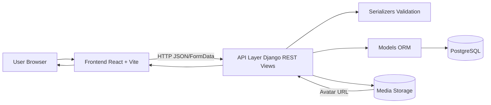
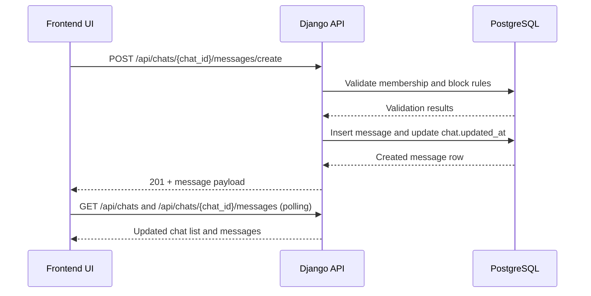
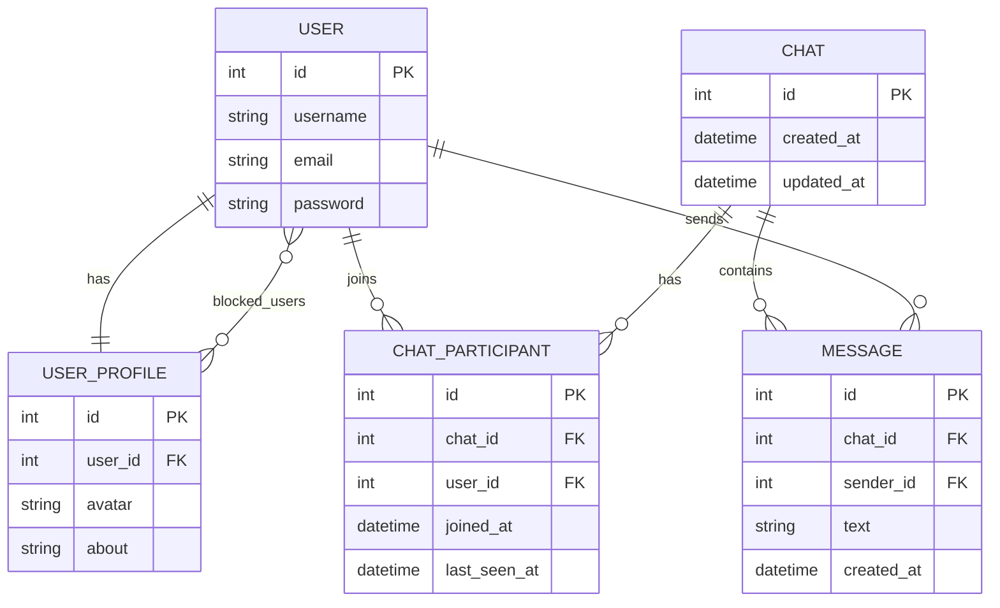

# Real-Time Chat Project BRD and Technical Walkthrough

## 1) Project Goal
This project started as a Firebase-based chat app. It was migrated to a Django + PostgreSQL backend while keeping the React frontend UI mostly unchanged.

Main goals completed:
- Remove Firebase auth, Firestore, and storage usage.
- Add Django REST API with token auth.
- Store users/chats/messages in PostgreSQL.
- Keep frontend behavior similar to previous UI.
- Add profile update (username, bio, avatar upload), password change, unread counts, and block/unblock support.

## 2) What Was Changed
### Backend migration
- New backend project under backend/ with Django + DRF.
- PostgreSQL database config via environment variables.
- Token authentication for API endpoints.
- Media file support for uploaded avatars.
- CORS setup for Vite local frontend ports.

### Frontend migration
- Firebase calls replaced with REST API calls.
- Auth token + user stored in Zustand.
- Chat polling implemented for list/messages updates.
- Profile image update changed to local upload and server-hosted media URL.
- WhatsApp-like avatar crop/adjust flow added before upload.

### Repo structure updates
- Frontend moved into front/.
- Images moved to front/public/images.

## 3) High-Level Architecture
- Frontend (React/Vite) sends HTTP requests to backend API.
- Backend (Django + DRF) validates data, checks permissions, reads/writes PostgreSQL.
- DRF token identifies current authenticated user.
- Backend returns JSON for chat UI state.

Request flow:
1. Frontend calls endpoint under /api/...
2. Django URL router maps endpoint to class-based view.
3. View validates request data through serializer.
4. View executes model queries and business rules.
5. View returns serialized response JSON.

## 4) Backend File-by-File Walkthrough

### backend/config/settings.py
Purpose: global Django configuration.

Line-by-line behavior summary:
1. Imports os and Path for environment and file paths.
2. BASE_DIR points to backend/ root.
3. load_local_env() reads backend/.env manually.
4. It skips blank/comment lines and sets env vars.
5. load_local_env(BASE_DIR / ".env") executes local env loading.
6. SECRET_KEY and DEBUG come from environment.
7. ALLOWED_HOSTS parsed from comma-separated env variable.
8. INSTALLED_APPS includes default Django apps plus:
   - corsheaders
   - rest_framework
   - rest_framework.authtoken
   - chatapp
9. MIDDLEWARE includes CORS middleware at top for preflight handling.
10. ROOT_URLCONF set to config.urls.
11. Template, WSGI, ASGI defaults configured.
12. DATABASES uses PostgreSQL values from env vars.
13. AUTH_PASSWORD_VALIDATORS use Django default policies.
14. Locale/timezone settings configured.
15. STATIC_URL, MEDIA_URL, MEDIA_ROOT configured.
16. DEFAULT_AUTO_FIELD sets BigAutoField as default PK type.
17. REST_FRAMEWORK defaults:
   - TokenAuthentication
   - IsAuthenticated for all endpoints by default
18. CORS_ALLOWED_ORIGINS allows explicit origins from env.
19. CORS_ALLOWED_ORIGIN_REGEXES allows dynamic localhost ports:
   - http://localhost:<port>
   - http://127.0.0.1:<port>

Why this matters:
- Token auth secures all API routes unless AllowAny is set per view.
- CORS config allows frontend dev server on changing ports.

### backend/config/urls.py
Purpose: root URL router.

Line-by-line behavior summary:
1. Imports settings/static helpers for media serving in DEBUG.
2. Imports admin, include, path.
3. urlpatterns includes:
   - /admin/ -> Django admin
   - /api/ -> chatapp.urls
4. If DEBUG is true, media URLs are served by Django for local development.

Why this matters:
- All app endpoints are namespaced under /api/.
- Uploaded avatar files can be fetched locally.

### backend/chatapp/models.py
Purpose: database schema for user profile, chats, participants, messages.

#### UserProfile model
- user: OneToOne with Django User.
- avatar: URL of user avatar image.
- about: short bio text.
- blocked_users: ManyToMany to User for block list.

How it works:
- Every user has one profile record.
- Block list stores IDs of users this user has blocked.

#### Chat model
- participants: ManyToMany(User) through ChatParticipant.
- created_at: creation timestamp.
- updated_at: last activity timestamp.

How it works:
- A chat is a conversation container.
- Participants and last seen info are managed via through model.

#### ChatParticipant model
- chat FK + user FK.
- joined_at timestamp.
- last_seen_at timestamp for unread calculation.
- unique_together(chat, user) prevents duplicate membership row.

How it works:
- Stores per-user state in a chat.
- last_seen_at lets backend compute unreadCount and isSeen.

#### Message model
- chat FK.
- sender FK.
- text body.
- created_at timestamp.
- ordering by created_at ascending.

How it works:
- Messages belong to one chat.
- Response order is oldest-to-newest by default.

### backend/chatapp/serializers.py
Purpose: request validation and response shaping.

Line-by-line behavior summary by class:
- RegisterSerializer:
  - Validates username/email uniqueness.
  - Lowers email case.
  - Accepts optional avatar URL.
- LoginSerializer:
  - Validates email/password fields.
- UpdateProfileSerializer:
  - Optional username/about/avatar URL/avatar_file.
- ChangePasswordSerializer:
  - Requires current_password and min-length new_password.
- MessageCreateSerializer:
  - Validates max text length.
- ChatCreateSerializer:
  - Validates receiver_id positive integer.
- UserSearchSerializer:
  - Validates query string.
- UserResponseSerializer:
  - Adds computed avatar/about/blocked from profile relation.
- MessageResponseSerializer:
  - Exposes senderId alias from sender_id.
- ChatSummarySerializer:
  - Defines chat list response shape including unreadCount.
- ChatMessagesSerializer:
  - Defines messages payload structure.
- ChatSerializer:
  - Standard model serializer for Chat.

Why this matters:
- Input is validated before database writes.
- Output shape is stable for frontend consumption.

### backend/chatapp/views.py
Purpose: business logic and API endpoint implementations.

#### Helper functions
1. ensure_profile(user): create profile if missing.
2. user_payload(user): normalized user JSON used across auth responses.
3. get_chat_for_pair(user_a, user_b): finds existing one-to-one chat.
4. chat_summary_for_user(chat, current_user): computes receiver info, last message, isSeen, unreadCount.

#### AuthRegisterView (POST /api/auth/register)
- Validates payload.
- Creates Django user.
- Creates profile and optional avatar URL.
- Creates token and returns token + user payload.

#### AuthLoginView (POST /api/auth/login)
- Validates payload.
- Finds user by email, authenticates with username+password.
- Returns existing/new token and user payload.

#### AuthMeView (GET /api/auth/me)
- Returns current authenticated user payload.

#### AuthLogoutView (POST /api/auth/logout)
- Deletes token for current user.

#### AuthProfileUpdateView (POST /api/auth/update-profile)
- Validates optional username/about/avatar/avatar_file.
- Username uniqueness check (excluding current user).
- Avatar file path generated with uuid and saved in media storage.
- Avatar URL built as absolute URL from request host.
- About (bio) updated if present.
- Returns updated user payload.

#### AuthChangePasswordView (POST /api/auth/change-password)
- Checks current password.
- Sets new password.
- Rotates token (delete old, create new).
- Returns new token + updated user payload.

#### UserSearchView (GET /api/users/search?q=...)
- Empty query returns [].
- Search by exact username/email and partial username.
- Excludes current user.
- Returns top 10 ordered by username.

#### UserBlockToggleView (POST /api/users/<id>/block-toggle)
- Prevents self-block.
- 404 if target user not found.
- Toggle add/remove in blocked_users.
- Returns new blocked state and blockedIds list.

#### ChatListView (GET /api/chats)
- Gets all chats where current user is participant.
- Builds summary for each chat via chat_summary_for_user().
- Sorts by updatedAt descending.
- Returns chat list with unreadCount/isSeen metadata.

#### ChatCreateView (POST /api/chats/create)
- Validates receiver_id.
- Prevents self-chat.
- Finds receiver or 404.
- Reuses existing pair chat if already exists.
- Else creates new chat + two ChatParticipant rows.
- Returns current-user chat summary.

#### ChatSeenView (POST /api/chats/<chat_id>/seen)
- Ensures user is a chat member.
- Updates member last_seen_at to now.
- Returns ok true.

#### ChatMessagesView (GET /api/chats/<chat_id>/messages)
- Ensures membership.
- Loads messages with sender relation.
- Serializes and returns full messages list.

#### MessageCreateView (POST /api/chats/<chat_id>/messages/create)
- Validates message text.
- Ensures sender is member.
- Resolves receiver (other chat participant).
- Enforces blocking rules both directions.
- Creates message and updates chat updated_at.
- Updates sender last_seen_at to now.
- Returns created message data.

Why this matters:
- All chat behavior, unread logic, block rules, and profile handling live here.

### backend/chatapp/urls.py
Purpose: route endpoint paths to view classes.

Routes:
- POST /api/auth/register -> AuthRegisterView
- POST /api/auth/login -> AuthLoginView
- GET /api/auth/me -> AuthMeView
- POST /api/auth/logout -> AuthLogoutView
- POST /api/auth/update-profile -> AuthProfileUpdateView
- POST /api/auth/change-password -> AuthChangePasswordView
- GET /api/users/search -> UserSearchView
- POST /api/users/<user_id>/block-toggle -> UserBlockToggleView
- GET /api/chats -> ChatListView
- POST /api/chats/create -> ChatCreateView
- POST /api/chats/<chat_id>/seen -> ChatSeenView
- GET /api/chats/<chat_id>/messages -> ChatMessagesView
- POST /api/chats/<chat_id>/messages/create -> MessageCreateView

## 5) Frontend Integration (Important Files)
This section explains where frontend calls backend and how state is managed.

- front/src/components/lib/api.js
  - Central request helper.
  - Adds Authorization token header when present.
  - Supports JSON and multipart FormData.

- front/src/components/lib/userStore.js
  - Stores token and current user.
  - Handles login session and logout reset.

- front/src/components/list/chatlist/chatlist.jsx
  - Calls chat list endpoint.
  - Displays unread badges.
  - Marks chat as seen when opened.

- front/src/components/chat/chat.jsx
  - Loads messages for selected chat.
  - Sends new messages via create-message endpoint.

- front/src/components/addUser/adduser.jsx
  - Searches users and creates chats.

- front/src/components/list/userinfo/userinfo.jsx
  - Logout, username/bio update, password change.
  - Avatar upload now uses crop modal before saving.

## 6) End-to-End Example Flows

### Register flow
1. Frontend posts username/email/password to /api/auth/register.
2. Backend creates user + profile + token.
3. Frontend stores token and user in Zustand.

### Send message flow
1. Frontend posts text to /api/chats/<id>/messages/create.
2. Backend checks membership + block rules.
3. Backend stores message and updates chat timestamp.
4. Frontend polling refresh shows new message and chat order.

### Unread flow
1. Receiver has old last_seen_at.
2. Sender sends messages.
3. chat_summary_for_user counts messages newer than last_seen_at.
4. Frontend shows unread badge.
5. Opening chat calls /seen and unread resets.

### Avatar update flow
1. User selects local image.
2. Frontend opens crop modal and user adjusts fit.
3. Frontend uploads cropped file as avatar_file.
4. Backend saves file in media storage and returns absolute avatar URL.

## 7) Environment and Run Commands
From project root:
- Backend: c:/Users/DELL/Desktop/project/.venv/Scripts/python.exe backend/manage.py runserver
- Frontend: cd front && npm run dev

Important env variables in backend/.env:
- DJANGO_SECRET_KEY
- DJANGO_DEBUG
- DJANGO_ALLOWED_HOSTS
- CORS_ALLOWED_ORIGINS
- POSTGRES_DB
- POSTGRES_USER
- POSTGRES_PASSWORD
- POSTGRES_HOST
- POSTGRES_PORT

## 8) Notes for Future Improvements
- Add WebSocket support (Django Channels) for real-time updates instead of polling.
- Add refresh token or JWT auth for larger-scale auth flows.
- Add automated tests for chat unread and block/unblock behavior.
- Add pagination for large message histories.

## 9) Architecture Diagrams

### 9.1 System Component Diagram

### 9.2 Request Sequence Diagram (Send Message)

### 9.3 Data Model Diagram (ER)

---
See API_REFERENCE.md for endpoint-by-endpoint request and response examples.
